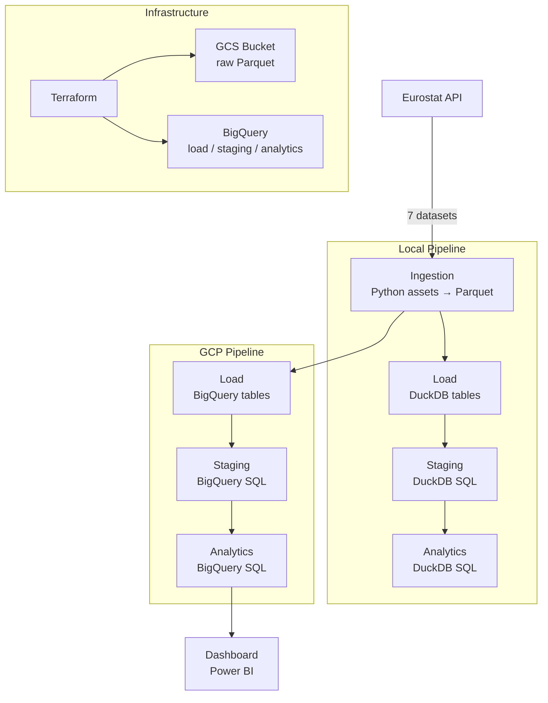
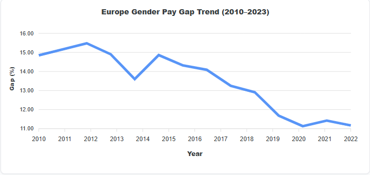
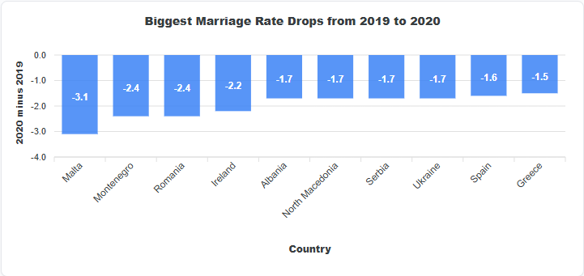
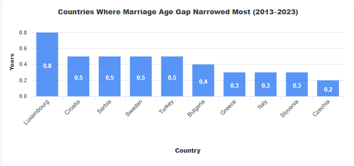
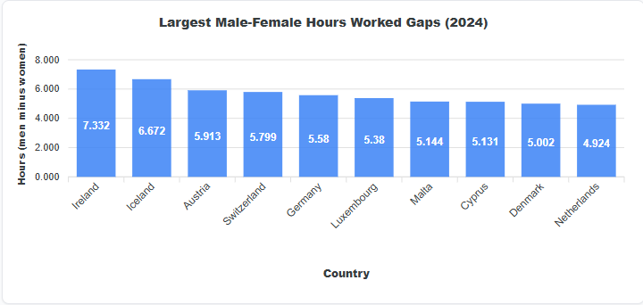
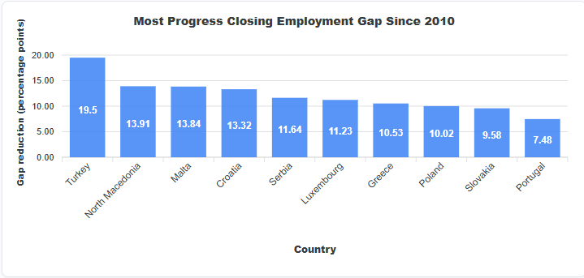

# Closer Every Year

A batch data pipeline tracking **gender gap indicators** and **relationship trends** (marriage, divorce, age at first marriage) across European countries from 2005 to 2024 — not to highlight division, but to measure progress.

The data tells a story of convergence: the pay gap is narrowing, the age at first marriage is growing closer between men and women, employment rates are balancing. Numbers collected consistently over two decades, with no agenda — just direction.

Built as capstone project for the [DataTalksClub Data Engineering Zoomcamp](https://github.com/DataTalksClub/data-engineering-zoomcamp).

---

## Why These Datasets?

The choice of topic was intentional. Comparing men and women sits in territory that can feel controversial — but that's precisely the point. Data has a unique power: it removes judgment from the equation. There are no opinions here, no agenda. Just numbers collected consistently across European countries over two decades.

And what do those numbers tell us? That the story of gender difference is also, increasingly, a story of convergence. The gender pay gap is narrowing. The age at which men and women marry is growing closer. Employment rates between sexes are moving toward balance. The data doesn't declare a winner — it shows a direction. And that direction, across Europe, is toward equality.

The marriage and divorce data adds another layer to this story. At first glance, a slight decline in marriage rates might seem like a negative signal — fewer people choosing to commit. But look closer: the average age at first marriage has been rising steadily across Europe, for both men and women. People aren't avoiding marriage — they're approaching it more deliberately, later in life, likely after establishing careers and financial independence. This is especially true for women, whose age at first marriage has grown faster than men's, narrowing that gap too.

And divorce? The rate has remained remarkably stable — even as marriages declined during COVID-19, the divorce-to-marriage ratio eventually returned to its long-term trend. The institution isn't collapsing. It's evolving, along with the people in it.

This project was built with that positive lens in mind. The goal was never to highlight division, but to measure progress. Because once you can measure something, you can understand it — and understanding is the first step forward.

---

## Table of Contents

- [Problem Statement](#problem-statement)
- [Architecture](#architecture)
- [Tech Stack](#tech-stack)
- [Datasets](#datasets)
- [Pipeline Layers](#pipeline-layers)
- [How to Run](#how-to-run)
- [CI/CD](#cicd)
- [Project Structure](#project-structure)
- [Dashboard](#dashboard)
- [Bruin AI Data Analyst](#bruin-ai-data-analyst)
- [Notes](#notes)

---

## Problem Statement

Two questions drive this project:

**Relationships & Gender**
- Is the gender pay gap correlated with marriage and divorce trends across European countries?
- Is the gap between male and female age at first marriage narrowing over time?

**Gender Gap at Work**
- How do hours worked, accident rates, and employment levels differ between men and women?
- Are these labour market gaps moving in the same direction as the gender pay gap?

---

## Architecture



Both pipelines share the same asset code. Local uses **DuckDB**, cloud uses **BigQuery**.
Bruin handles orchestration, dependency resolution, and materialization for both.

---

## Tech Stack

| Layer | Tool | Why |
|---|---|---|
| Orchestration + Transformation | [Bruin](https://getbruin.com) | Unified Python + SQL pipeline runner |
| Local Warehouse | DuckDB | Fast, zero-setup local development |
| Cloud Warehouse | BigQuery (GCP) | Partitioned + clustered tables for analytics |
| Data Lake | GCS (Google Cloud Storage) | Parquet staging before BigQuery load |
| Infrastructure as Code | Terraform | Reproducible GCP setup |
| Containerization | Docker + Docker Compose | Consistent environment for Bruin + Terraform |
| CI/CD | GitHub Actions | Scheduled pipeline runs + manual Terraform trigger |
| Dashboard | Power BI | Connected directly to BigQuery |

---

## Datasets

All data from the [Eurostat API](https://ec.europa.eu/eurostat):

| Dataset | Eurostat Code | Key Columns |
|---|---|---|
| Crude marriage rate | `tps00206` | country, year, marriage_rate |
| Crude divorce rate | `tps00216` | country, year, divorce_rate |
| Mean age at first marriage | `tps00014` | country, year, age_at_marriage_f/m |
| Gender pay gap | `sdg_05_20` | country, year, gender_pay_gap |
| Hours worked (M/F) | `lfsa_ewhan2` | country, year, sex, hours_worked |
| Work accidents (M/F) | `hsw_n2_01` | country, year, sex, accidents |
| Employment rate (M/F) | `lfsa_eegan2` | country, year, sex, employed |

---

## Pipeline Layers

### Ingestion
Python assets download raw data from the Eurostat API and save Parquet files to local disk or GCS.

### Load
Python assets read the Parquet files, unpivot from wide (year columns) to long format using `pandas.melt()`,
and write clean tables to DuckDB or BigQuery.

### Staging
SQL assets apply final transformations: M/F pivots, delta columns, null removal.
Uses `strategy: merge` on `(country, year)` — idempotent, no duplicates on re-run.

### Analytics
Two final tables, both partitioned by `year_date` (DATE) and clustered by `country`:

**`analytics.relationships`** — marriage, divorce, age at marriage, gender pay gap

| Column | Description |
|---|---|
| `year_date` | DATE(year, 12, 31) — used for partitioning |
| `country` | ISO 2-letter country code |
| `year` | Year (integer) |
| `marriage_rate` | Marriages per 1,000 inhabitants |
| `divorce_rate` | Divorces per 1,000 inhabitants |
| `age_at_marriage_f` | Mean age at first marriage — women |
| `age_at_marriage_m` | Mean age at first marriage — men |
| `gender_pay_gap` | % pay gap (men earn X% more than women) |

**`analytics.gender_gap`** — labour market gender indicators

| Column | Description |
|---|---|
| `year_date` | DATE(year, 12, 31) — used for partitioning |
| `country` | ISO 2-letter country code |
| `year` | Year (integer) |
| `hours_worked_m` | Mean hours worked per week — men |
| `hours_worked_f` | Mean hours worked per week — women |
| `hours_worked_delta` | hours_worked_m − hours_worked_f |
| `gender_pay_gap` | % pay gap |
| `accidents_m` | Work accidents — men |
| `accidents_f` | Work accidents — women |
| `employed_m` | Employment rate — men |
| `employed_f` | Employment rate — women |

### Key Design Decisions

- **`pandas.melt()` instead of SQL UNPIVOT** — BigQuery does not support dynamic column pivoting, so the wide→long transformation happens in Python before the data reaches SQL
- **Terraform as schema source of truth** — `strategy: merge` requires tables to exist before the first run; Terraform pre-creates all staging and analytics tables with explicit schemas
- **`type: table` for Python load assets** — dlt (used internally by Bruin) raises a 409 conflict when multiple assets run in parallel with `strategy: merge`; full replace avoids this
- **`--workers 1` for local** — DuckDB does not support concurrent writes; the GCP pipeline runs with full parallelism

> Full rationale in [docs/strategy.md](docs/strategy.md).

---

## How to Run

### Prerequisites

- Docker + Docker Compose installed and **running**
- A `.env` file — **required for both local and GCP**, Docker Compose will fail without it:
  ```bash
  cp .env.example .env
  ```
  For local development, only `GCP_PROJECT_ID` and `GCS_BUCKET` can be left empty. `GOOGLE_CREDENTIALS` is only needed for the GCP pipeline.
- A `.bruin.yml` file — same file for both local and cloud:
  ```bash
  cp .bruin.yml.example .bruin.yml
  ```
  `GCP_PROJECT_ID` and `GOOGLE_CREDENTIALS` are read from `.env` at runtime — no hardcoded credentials.

> Both pipelines run inside Docker containers — make sure Docker is running before any `docker compose` or `docker exec` command.

---

### Local Pipeline (DuckDB — no cloud required)

**1. Start the container**

```bash
docker compose up -d
```

**2. Run the pipeline**

```bash
docker exec -it bruin-pipeline bruin run local-pipeline --workers 1
```

> `--workers 1` is required — DuckDB does not support concurrent writes.

**3. Query results**

```python
import duckdb

with duckdb.connect("data/duckdb.db") as conn:
    df = conn.execute("SELECT * FROM analytics.relationships LIMIT 10").df()
    print(df)
```

---

### GCP Pipeline (BigQuery)

**1. Create `.env`** from the example file and fill in your GCP credentials:

```bash
cp .env.example .env
```

See `.env.example` for the required variables (`GOOGLE_CREDENTIALS`, `GCP_PROJECT_ID`, `GCS_BUCKET`).

**2. Start the containers**

```bash
docker compose up -d
```

**4. Apply Terraform** (creates GCS bucket + BigQuery datasets + tables):

```bash
docker exec -it terraform sh
terraform init
terraform apply -auto-approve
exit
```

**5. Run the GCP pipeline**

```bash
docker exec -it bruin-pipeline bruin run --environment cloud gcp-pipeline
```

---

## CI/CD

Two GitHub Actions workflows handle automated runs:

### Pipeline (`pipeline.yml`)

Runs the full GCP pipeline automatically twice a year (Eurostat data updates on this cadence)
and can be triggered manually from the Actions tab.

```
Scheduled: 1 January and 1 July at 08:00 UTC
Manual:    GitHub Actions → Run workflow
```

**Steps**: checkout → create `.env` → create `.bruin.yml` → start Docker containers → run pipeline → tear down

### Terraform (`terraform.yml`)

Manual-only trigger — used when infrastructure needs to be created or updated (schema changes, new tables).

```
Manual: GitHub Actions → Run workflow
```

### Required Secrets and Variables

Configure these in **GitHub → Settings → Secrets and variables → Actions**:

| Name | Type | Value |
|---|---|---|
| `GOOGLE_CREDENTIALS` | Secret | GCP service account JSON (content of the `.json` file) |
| `BRUIN_YML` | Secret | Full content of your `.bruin.yml` |
| `GCP_PROJECT_ID` | Variable | Your GCP project ID |
| `GCS_BUCKET` | Variable | Your GCS bucket path (e.g. `gs://my-bucket`) |
| `TF_VAR_bucket` | Variable | GCS bucket name without `gs://` prefix (e.g. `my-bucket`) |
| `TF_VAR_region` | Variable | GCP region for Terraform (e.g. `EU`) |


---

## Project Structure

```
├── .github/
│   └── workflows/
│       ├── pipeline.yml   # Scheduled + manual GCP pipeline run
│       └── terraform.yml  # Manual Terraform apply
├── gcp-pipeline/
│   └── assets/
│       ├── ingestion/     # Python — Eurostat API → GCS Parquet
│       ├── load/          # Python — Parquet → BigQuery tables
│       ├── staging/       # SQL — clean & transform
│       └── analytics/     # SQL — final joined tables
├── local-pipeline/
│   └── assets/            # Same structure, DuckDB instead of BigQuery
├── terraform/
│   ├── main.tf            # Provider, GCS bucket, BQ datasets
│   ├── tables.tf          # All BigQuery table schemas
│   ├── variables.tf
│   └── output.tf
├── notebooks/             # Exploratory data analysis
├── docs/                  # Project documentation
├── Dockerfile.bruin       # Custom Bruin image with Python dependencies
├── docker-compose.yml     # Bruin + Terraform containers
└── .bruin.yml             # Bruin connection config (not committed)
```

---

## Dashboard

Built with Power BI, connected directly to BigQuery (`analytics.relationships` and `analytics.gender_gap`).

**Gender Gap labour market indicators**


**Marriage & Divorce trends across Europe**


---

## Bruin AI Data Analyst

Analysis performed using the Bruin AI agent directly on the BigQuery analytics tables:

**Gender Pay Gap trend**


**Marriage rate drop analysis**


**Age at marriage gap between men and women**


**Hours worked delta between men and women**


**Employment gap between men and women**


---

## Notes

- See [docs/strategy.md](docs/strategy.md) for pipeline design decisions and known issues
- See [docs/troubleshooting.md](docs/troubleshooting.md) for common errors and fixes
