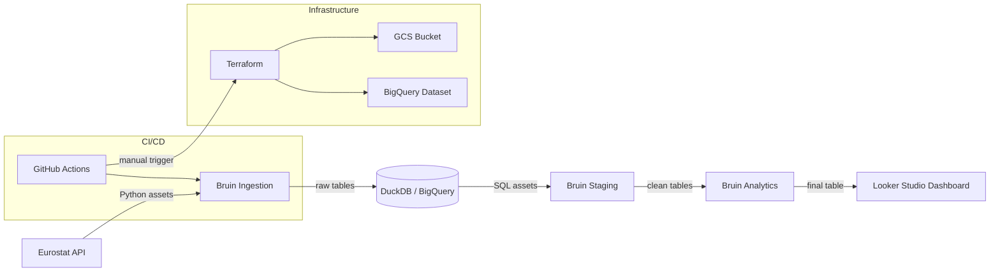

# European Relationships & Economics — Data Engineering Project

A batch data pipeline analyzing the relationship between **economic inequality** and **relationship indicators** (marriage, divorce, age at first marriage) across European countries from 2005 to 2024.

Built as capstone project for the [DataTalksClub Data Engineering Zoomcamp](https://github.com/DataTalksClub/data-engineering-zoomcamp).

---

## Problem Statement

Do economic factors influence how and when people form relationships?

This project explores three core questions:
- Do countries with higher income inequality have **higher divorce rates**?
- How has the gap between male and female income evolved alongside marriage and divorce trends?
- Is the gap between male and female income narrowing over time?


---

## Architecture



---

## Tech Stack

| Layer | Tool |
|---|---|
| Ingestion + Transformation | [Bruin](https://getbruin.com) |
| Local Warehouse | DuckDB |
| Cloud Warehouse | BigQuery (GCP) |
| Infrastructure as Code | Terraform |
| Containerization | Docker + Docker Compose |
| CI/CD | GitHub Actions |
| Dashboard | Looker Studio |

---

## Dataset Sources

All data from [Eurostat API](https://ec.europa.eu/eurostat):

| Dataset | Eurostat Code |
|---|---|
| Crude marriage rate | `tps00206` |
| Crude divorce rate | `tps00216` |
| Mean age at first marriage (women) | `tps00014` |
| Income quintile share ratio S80/S20 | `tessi180` |

---

## Project Structure

```
├── assets/
│   ├── ingestion/        # Python assets — Eurostat API calls
│   ├── staging/          # SQL assets — cleaning & transformation
│   └── analytics/        # SQL assets — final joined table
├── terraform/            # GCP infrastructure (GCS + BigQuery)
├── notebooks/            # Exploratory data analysis
├── docs/                 # Troubleshooting & project notes
├── Dockerfile.bruin      # Custom Bruin image with dependencies
├── docker-compose.yml    # Local development environment
└── pipeline.yml          # Bruin pipeline definition
```

---

## How to Run Locally

### Prerequisites
- Docker + Docker Compose
- Git

### Steps

**1. Clone the repository**
```bash
git clone <repo-url>
cd DataTalksClubLearning
```

**2. Create `.bruin.yml`** (see `.bruin.yml.example`)
```yaml
default_environment: local

environments:
  local:
    connections:
      duckdb:
        - name: "local_duckdb"
          path: "data/duckdb.db"
```

**3. Start the container**
```bash
docker compose up -d
```

**4. Run the pipeline**
```bash
docker exec -it bruin-pipeline bruin run --workers 1
```

**5. Query the results**
```python
import duckdb

with duckdb.connect("data/duckdb.db") as conn:
    df = conn.execute("SELECT * FROM analytics.relationships LIMIT 10").df()
    print(df)
```

---

## Pipeline Layers

### Ingestion
Raw data downloaded from Eurostat API via Python assets. Stored as-is in DuckDB `ingestion` schema.

### Staging
- Year columns unpivoted from wide to long format
- `_` prefix removed from year column, cast to integer
- Income quintile split into `income_quintile_f` and `income_quintile_m`
- Null values removed

### Analytics
Final table joining all 4 datasets on `country` + `year`:

| Column | Description |
|---|---|
| `country` | ISO country code |
| `year` | Year |
| `marriage_rate` | Marriages per 1000 inhabitants |
| `divorce_rate` | Divorces per 1000 inhabitants |
| `age_at_marriage` | Mean age at first marriage (women) |
| `income_quintile_f` | S80/S20 ratio — Female |
| `income_quintile_m` | S80/S20 ratio — Male |

---

## Dashboard

> Coming soon — Looker Studio

Two tiles:
1. **Income inequality vs divorce rate** — scatter plot by country
2. **Trends over time** — marriage & divorce rates vs female income quintile

---

## Notes

- `--workers 1` is required for local DuckDB runs — DuckDB does not support concurrent writes
- See [docs/troubleshooting.md](docs/troubleshooting.md) for common issues and solutions
