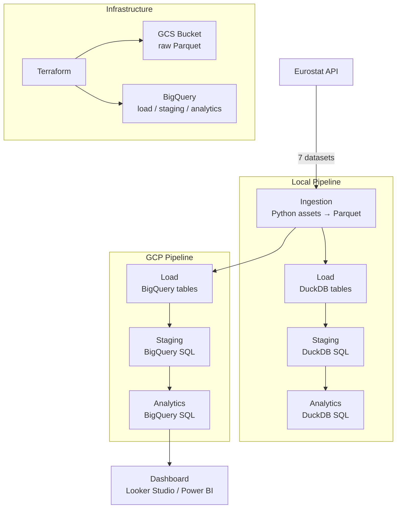

# Data Engineering Project

A batch data pipeline analyzing the relationship between **economic inequality**, **gender gap indicators**,
and **relationship trends** (marriage, divorce, age at first marriage) across European countries from 2005 to 2024.

Built as capstone project for the [DataTalksClub Data Engineering Zoomcamp](https://github.com/DataTalksClub/data-engineering-zoomcamp).

---

## Problem Statement

Do economic and gender factors influence how and when people form relationships?

This project explores two angles:

**Relationships & Inequality**
- Do countries with higher income inequality have higher divorce rates?
- Is the gap between male and female age at marriage narrowing over time?

**Gender Gap at Work**
- How do hours worked, accident rates, and employment levels differ between men and women?
- Is the gender pay gap correlated with other labour market indicators?

---

## Architecture



Both pipelines share the same asset code. Local uses **DuckDB**, cloud uses **BigQuery**.
Bruin handles orchestration, dependency resolution, and materialization for both.

---

## Tech Stack

| Layer | Tool | Why |
|---|---|---|
| Orchestration + Transformation | [Bruin](https://getbruin.com) | Unified Python + SQL pipeline runner |
| Local Warehouse | DuckDB | Fast, zero-setup local development |
| Cloud Warehouse | BigQuery (GCP) | Partitioned + clustered tables for analytics |
| Data Lake | GCS (Google Cloud Storage) | Parquet staging before BigQuery load |
| Infrastructure as Code | Terraform | Reproducible GCP setup |
| Containerization | Docker + Docker Compose | Consistent environment for Bruin + Terraform |
| Dashboard | Looker Studio / Power BI | Connected directly to BigQuery |

---

## Datasets

All data from the [Eurostat API](https://ec.europa.eu/eurostat):

| Dataset | Eurostat Code | Key Columns |
|---|---|---|
| Crude marriage rate | `tps00206` | country, year, marriage_rate |
| Crude divorce rate | `tps00216` | country, year, divorce_rate |
| Mean age at first marriage | `tps00014` | country, year, age_at_marriage_f/m |
| Gender pay gap | `sdg_05_20` | country, year, gender_pay_gap |
| Hours worked (M/F) | `lfsa_ewhan2` | country, year, sex, hours_worked |
| Work accidents (M/F) | `hsw_n2_01` | country, year, sex, accidents |
| Employment rate (M/F) | `lfsa_eegan2` | country, year, sex, employed |

---

## Pipeline Layers

### Ingestion
Python assets download raw data from the Eurostat API and save Parquet files to local disk or GCS.

### Load
Python assets read the Parquet files, unpivot from wide (year columns) to long format using `pandas.melt()`,
and write clean tables to DuckDB or BigQuery.

### Staging
SQL assets apply final transformations: M/F pivots, delta columns, null removal.
Uses `strategy: merge` on `(country, year)` — idempotent, no duplicates on re-run.

### Analytics
Two final tables, both partitioned by `year_date` (DATE) and clustered by `country`:

**`analytics.relationships`** — marriage, divorce, age at marriage, gender pay gap

| Column | Description |
|---|---|
| `year_date` | DATE(year, 12, 31) — used for partitioning |
| `country` | ISO 2-letter country code |
| `year` | Year (integer) |
| `marriage_rate` | Marriages per 1,000 inhabitants |
| `divorce_rate` | Divorces per 1,000 inhabitants |
| `age_at_marriage_f` | Mean age at first marriage — women |
| `age_at_marriage_m` | Mean age at first marriage — men |
| `gender_pay_gap` | % pay gap (men earn X% more than women) |

**`analytics.gender_gap`** — labour market gender indicators

| Column | Description |
|---|---|
| `year_date` | DATE(year, 12, 31) — used for partitioning |
| `country` | ISO 2-letter country code |
| `year` | Year (integer) |
| `hours_worked_m` | Mean hours worked per week — men |
| `hours_worked_f` | Mean hours worked per week — women |
| `hours_worked_delta` | hours_worked_m − hours_worked_f |
| `gender_pay_gap` | % pay gap |
| `accidents_m` | Work accidents — men |
| `accidents_f` | Work accidents — women |
| `employed_m` | Employment rate — men |
| `employed_f` | Employment rate — women |

---

## How to Run

### Prerequisites

- Docker + Docker Compose
- A `.env` file (copy from `.env.example`)
- A `.bruin.yml` file (copy from `.bruin.yml.example`)

---

### Local Pipeline (DuckDB — no cloud required)

**1. Configure `.bruin.yml`**

```yaml
default_environment: local

environments:
  local:
    connections:
      duckdb:
        - name: "local_duckdb"
          path: "data/duckdb.db"
```

**2. Start the container**

```bash
docker compose up -d
```

**3. Run the pipeline**

```bash
docker exec -it bruin-pipeline bruin run local-pipeline --workers 1
```

> `--workers 1` is required — DuckDB does not support concurrent writes.

**4. Query results**

```python
import duckdb

with duckdb.connect("data/duckdb.db") as conn:
    df = conn.execute("SELECT * FROM analytics.relationships LIMIT 10").df()
    print(df)
```

---

### GCP Pipeline (BigQuery)

**1. Create `.env`** from the example file:

```bash
cp .env.example .env
# then fill in your GCP project ID and service account JSON
```

See `.env.example` for the required variables (`GOOGLE_CREDENTIALS`, `GCP_PROJECT_ID`, `GCS_BUCKET`).

**2. Apply Terraform** (creates GCS bucket + BigQuery datasets + tables):

```bash
docker exec -it terraform sh
terraform init
terraform apply -auto-approve
exit
```

**3. Run the GCP pipeline**

```bash
docker exec -it bruin-pipeline bruin run gcp-pipeline
```

---

## Project Structure

```
├── gcp-pipeline/
│   └── assets/
│       ├── ingestion/     # Python — Eurostat API → GCS Parquet
│       ├── load/          # Python — Parquet → BigQuery tables
│       ├── staging/       # SQL — clean & transform
│       └── analytics/     # SQL — final joined tables
├── local-pipeline/
│   └── assets/            # Same structure, DuckDB instead of BigQuery
├── terraform/
│   ├── main.tf            # Provider, GCS bucket, BQ datasets
│   ├── tables.tf          # All BigQuery table schemas
│   ├── variables.tf
│   └── output.tf
├── notebooks/             # Exploratory data analysis
├── docs/                  # Project documentation
├── Dockerfile.bruin       # Custom Bruin image with Python dependencies
├── docker-compose.yml     # Bruin + Terraform containers
└── .bruin.yml             # Bruin connection config (not committed)
```

---

## Notes

- See [docs/strategy.md](strategy.md) for pipeline design decisions and known issues
- See [docs/troubleshooting.md](troubleshooting.md) for common errors and fixes
